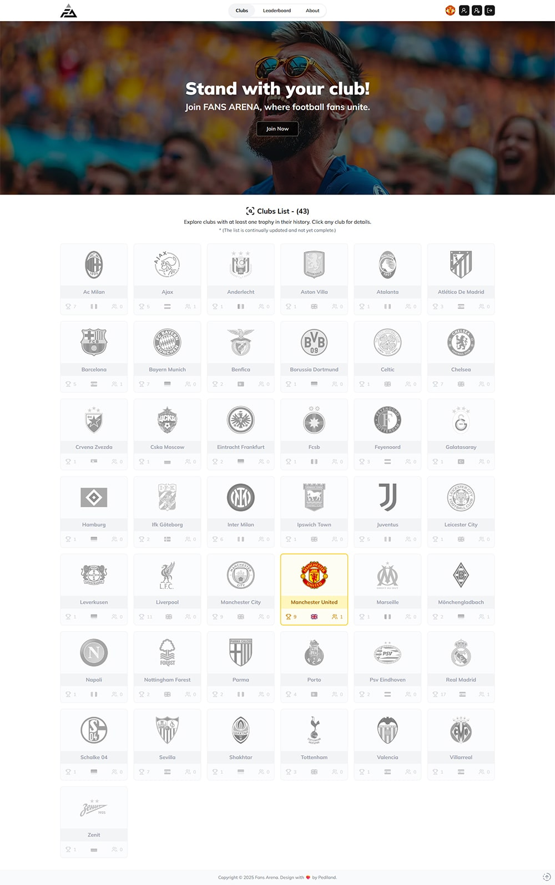

# Fans Arena – Frontend

**Followers are not Fans!**  
Fans Arena is a transparent, global platform where real football fans can register their support for their favorite clubs—openly and easily. For the first time, team popularity and rankings are revealed by real fans, for real fans.



---

## Beta Version – Portfolio Project

This is the frontend (React) of Fans Arena, developed as the final project for the Ironhack Web Development Bootcamp by **Pedram Ghane** (*Full Stack Developer*).

**Tech stack:**
- [React](https://react.dev/)
- [Tailwind CSS](https://tailwindcss.com/)
- [shadcn/ui](https://ui.shadcn.com/)
- [axios](https://axios-http.com/)
- [react-hook-form](https://react-hook-form.com/)
- [lucide-react](https://lucide.dev/) *(icons)*
- [Vite](https://vitejs.dev/) *(or CRA, specify your actual build tool)*
- ...and more

Live Demo: **[fansarena.netlify.app](https://fansarena.netlify.app/)**

---

## Features

- Modern, responsive UI for football fan engagement
- Live leaderboards and club rankings
- User profile management
- Authentication & registration flows
- Admin dashboard access (demo)
- Optimized for performance and UX

---

## Getting Started

### Prerequisites
- **Node.js** (v18+ recommended)
- **npm** or **yarn**
- Backend API (running separately – see [fans-arena-server](https://github.com/iampedi/fansarena-server))

### Installation

Clone this repository:

```bash
git clone https://github.com/iampedi/fansarena-client
